# Table of Contents
1. [Getting Started](#getting-started)
1. [Kerckhoffs' Principle](#kerckhoffs-principle)
1. [Randomness](#randomness)
    1. [Secure Randomness in NETstandard](#secure-randomness-in-netstandard)
    1. [Further Reading](#randomness-further-reading)
1. [Hashing](#hashing)
    1. [Basics](#basics)
        1. [Requirements](#requirements)
        1. [Merkle–Damgård construction](#merkledamgård-construction)
        1. [Sponge Construction ](#sponge-construction)
        1. [Attacks](#hashing-attacks)
            1. [Birthday Attack](#birthday-attack)
            1. [Length Extension](#length-extension)
            1. [Partial Message Collision](#partial-message-collision)
    1. [Algorithm](#hashing-algorithm)
        1. [SHA2](#sha2)
        1. [SHA3 (Keccak)](#sha3-keccak)
        1. [BLAKE2](#blake2)
    1. [HMAC](#hmac)
1. [Password Hashing](#password-hashing)
    1. [Attacks against Password Hashes](#attacks-against-password-Hashes)
    1. [Protection](#protection)
    1. [Algorithm](#password-algorithm)  
        1. [PBKDF2](#pbkdf2)
        1. [Bcrypt](#bcrypt)
        1. [Scrypt](#scrypt)
        1. [Argon2](#argon2)
    1. [Password Hashing in NETstandard](#password-hashing-in-netstandard)
    1. [Secure Passwords](#secure-passwords)
        1. [Password Length](#password-length)
        1. [Forbid known Passwords](#forbid-known-passwords)
        1. [Characters](#characters)
        1. [Password Pasting](#password-pasting)
        1. [Password Expiration](#password-expiration)
        1. [More](#more)
    1. [Conclusion](#conclusion)
1. [Keeping Keys Secure](#keeping-keys-secure)
    1. [Storing Secrets](#storing-secrets)
        1. [Windows](#windows-dpapi)
        1. [Apple Keychain](#apple-keychain)
        1. [Android Keystore](#android-keystore-system)
    1. [Using Secrets](#using-secrets)
1. [Symmetric Cryptography](#symmetric-cryptography)
    1. [Symmetric Keys](#symmetric-keys)
    1. [Block Ciphers](#block-ciphers)
        1. [ECB](#ecb)
        1. [CBC](#CBC)
        1. [Padding](#padding)
    1. [Stream Cipher](#Stream-Cipher)
        1. [CTR](#ctr)
        1. [Salsa20](#salsa20)
    1. [AES](#the-aes)
        1. [Algorithm](#algorithm)
        1. [AES in NETstandard](#aes-in-netstandard)
            1. [Encrypt](#encrypt)
            1. [Decrypt](#decrypt)
            1. [Usage](#usage)
    1. [Authentication](#authentication)
    1. [Usage in Protocols](#usage-in-protocols)

# Kerckhoffs' Principle
> One assumption made in all models is the so-called Kerckhoffs' principle, which states that the security of a cipher should rely only on the secrecy of the key and not on the secrecy of the cipher. This may sound obvious today, when ciphers and protocols are publicly specified and used by everyone. But historically, Dutch linguist Auguste Kerckhoffs was referring to military encryption machines specifically designed for a given army or division. Quoting from his 1883 essay “La Cryptographie Militaire,” where he listed six requirements of a military encryption system: “The system must not require secrecy and can be stolen by the enemy without causing trouble.”
[Serious Cryptography] 

<!-- 
ToDo: Write about why this is cited
- Crypto is pretty open
- Learn the algorithms
- Use open algorithms
- ...
 -->

# Randomness
Random numbers are essential for cryptographic algorithms. For example, without randomness it would be impossible to create secret keys for encryption. Operations would become predictable and, therefore, not secure.

Randomness is hard to archive by algorithms only. To get cryptographic secure random numbers, the operation systems uses RandomNumberGenerators (RNGs) to fill an entropy-pool. RNGs create randomness from I/O-operations, disk interrupts, network traffic or other unpredictable events. A PseudoRandomNumberGeneators (PRNGs) than take bytes out of the entropy-pool and turn them into high quality random bits by using cryptographic functions like hashing. To be a Cryptographic Secure Pseudo Number Generators (CSPRNGs) the PRNG need to provide forward secrecy and backward secrecy, meaning the previously bits cannot be recovered and future bits cannot be predicted. This can be achieved by using cryptographic secure [hashing algorithms](#hashing), which are explained later.

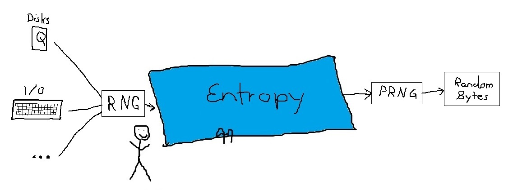

These Cryptographic Secure Pseudo Number Generators (CSPRNGs) are **not** used by the standard random functions by most software libraries, e.g. `System.Random` in .NET.
Therefore, **never** use these standard functions for random numbers in crypto applications.

## Secure Randomness in NETstandard
In NETstandard, the class `RandomNumberGenerator` of `System.Security.Cryptography` provides a CSPRNG. 

```cs
var rNumber = new byte[length];
using (var rng = RandomNumberGenerator.Create())
{
    rng.GetBytes(rNumber);
}
```

`RandomNumberGenerator.Create()` returns a `RNGCryptoServiceProvider` which uses the [BCryptGenRandom](https://docs.microsoft.com/en-us/windows/desktop/api/bcrypt/nf-bcrypt-bcryptgenrandom) function on Windows and the [RAND_bytes](https://www.openssl.org/docs/manmaster/man3/RAND_bytes.html) function of OpenSSL otherwise.

<!-- ### Randomness Further Reading
- Jean-Philippe Aumasson - [Serious Cryptography (2017)](https://seriouscrypto.com/) Chapter 2 -->

# Hashing
Hashing is used nearly everywhere in cryptography. PRNGs use them to turn entropy into secure random numbers, key derivation functions create cryptographic keys from passwords, public key crypto needs them for signing and hashing can also be used to validate the integrity of data. Nearly all cryptographic protocols uses hashing somewhere.

<!-- ### Use Case
Like explained above hashing is used everywhere. 
- Verifying data and message integrity
- Sigantures
- Password verification -->
## Basics

> The ideal hash function behaves like a random mapping from all possible inputs to a set of all possible output values. [Schneier, Cryptogaphic Engineering]

A hash function takes an arbitrary input and turns it into a fixed length output. Since the same input always generates the same output, a hash sometimes is described as the *fingerprint* of the input which is just as unique as a fingerprint of a person. Like with a fingerprint, a hash is a unique property that can be used to identify something/someone, without being able to reconstruct the source. However, you cannot create a person from the person’s fingerprint. This property is called pre image resistance.  
For a given hash, it should be impossible to find a message m so that m generates the hash.  
There also is a second pre image resistance that says, when given a message it should be impossible to find a second message with the same hash.

Since hash functions generate fixed length outputs, the number of possible outputs is also limited. Do to the arbitrary length of all possible inputs, according to the [pigeonhole principle](https://en.wikipedia.org/wiki/Pigeonhole_principle), there need to be messages that generate the same hash output. But to be considered as a secure hashing algorithm these collisions need to be hard to find. This gives the third property, collision resistance. 

In the past, a lot of hashing functions failed at the collision resistance. For example, [MD5 was broken](https://en.wikipedia.org/wiki/MD5#Collision_vulnerabilities) in 1996, and [SHA1](https://en.wikipedia.org/wiki/SHA-1#Attacks) in 2017. These algorithms should be avoided for new developments and, therefore, they are not further described.

Most algorithms are based on the [Merkle–Damgård construction](#merkledamgård-construction)) (From MD5 to SHA2 and BLAKE2). To prevent the 'collapse' of the whole SHA-Family if this construction is broken, Keccak was chosen for SHA3. Keccak is based on the [Sponge construction](#sponge-construction).

### Requirements

Hash algorithms are also used in other fields. For example for indexes in databases and hash-lists. In both use cases, they need some basic requirements:

1. **Arbitrary input length**: The input can be of arbitrary length.
1. **Fixed output length**: The output always needs to be the same length.
1. **Efficiency**: The computation of hash needs to be *fast*.

As explained before, a secure hash function needs to fulfill three additional properties.

#### Preimage Resistance

Given a hash `h`, no message `x` should be found so that `Hash(x) = h`.

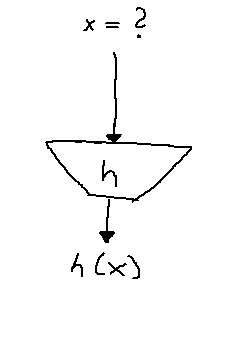

#### Second Preimage Resistance

Given a message `x1`, no second message `x2` should be found, so that `Hash(x1) = Hash(x2)`.


#### Collision Resistance

It should not be possible to find a pair of messages `x1` and `x1` (with x1 ≠ x1), so that `Hash(x1) = Hash(x1)`.

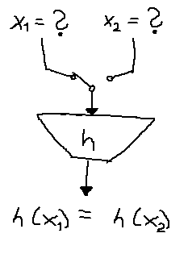

### Merkle–Damgård Construction

The Merkle–Damgård construction runs over the blocks of the message, and mixes them together iteratively.

The input message `M` is split into the blocks M<sub>1</sub>, ..., M<sub>n</sub>, so that the length of M<sub>i</sub> is equal to the block's size `a`. If M is shorter than `a*n`, the last block needs to be padded.  
Then a function `F` than take a block M<sub>i</sub> and the previous output to create the next output. The output of `F` is of a fixed length. After all blocks are consumed, the resulting output is the hash of the message.

<pre>
H<sub>0</sub> = Fixed IV   
For M<sub>1</sub>, ..., M<sub>n</sub> 
    H<sub>i</sub> = F(M<sub>i</sub>, H<sub>i-1</sub>)
Output = H<sub>n</sub>
</pre>

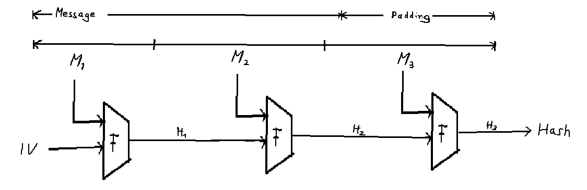

`F` needs to be a one-way compression function. Nearly all compression functions that are used in real world hash algorithms are based on a block cipher `E`. Block ciphers are explained [later](#block-ciphers). To prevent the block ciphers decryption function, the [**Davies-Meyers-Construction**](https://en.wikipedia.org/wiki/One-way_compression_function#Davies%E2%80%93Meyer) is often used. This construction XORs the result of the block cipher with the previous hash.

<pre>
H<sub>i</sub> = E(M<sub>i</sub>, H<sub>i-1</sub>) ⊕ H<sub>i-1</sub>
</pre>

### Sponge Construction 

The Sponge construction consists of two phases: absorbing and squeezing. Like a sponge, the hashing algorithm would absorb the message and then can be squeezed to get the hash.

Like with Merkle–Damgård, the message also is split into `n` blocks of size `r` (block size) and padded to `r*n` if needed.

The Sponge construction is based on the permutation of an inner state, where the state is `b` bits, with `b = r+c`. `c` is called the capacity. 

During the absorbing phase the first `r` bits of a state `b` gets XORed with the message block and then transformed to a new state using a permutation function `F`. The new state is, again, XORed with the next block and permuted with `F`.  
After the whole message is absorbed, the hash is constructed in the squeezing phase, where the first `r` bits of the state are returned before the state is permuted again and the next r bits are taken. This can be repeated until the desired number of bits is reached.

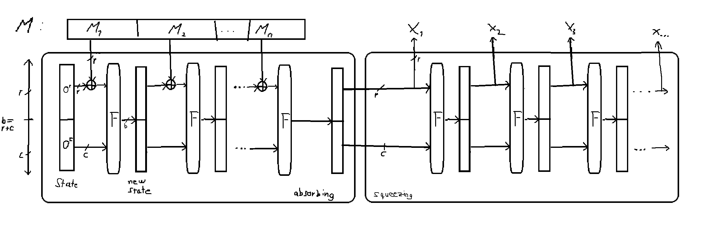

A detailed explanation for sha3 and the Sponge construction is given in [Lecture 21 by Christof Paar](https://www.youtube.com/watch?v=JWskjzgiIa4).

### Hashing Attacks

#### [Birthday Attack](https://en.wikipedia.org/wiki/Birthday_attack)
For 2<sup>n</sup> possible values only 2<sup>n/2</sup> values are needed to find a collision.

This is the result of the so-called [Birthday problem](https://en.wikipedia.org/wiki/Birthday_problem) or Birthday paradox in probability theory. How many people do you need to find two having birthday on the same day? The pigeonhole principle tells us, that we need 366 people (ignoring leap years) to have a collision with 100%. However, to have a probability of 50% you only need 23 people. Which is much less than one would assume naively.  
<!-- ToDo: Add Image
- Explain why (number of comparsions done) -->

#### Length Extension
The iterative structures of the Merkle–Damgård construction can be exploited with the Length extension attack. 

Given the hash of an unknown message `K||M` where `K` is a authentication key, the hash can be used as input for a block `A`, so that it possible to extend the unknown message by keeping a valid block. *For validation, the receiver would construct the hash for `K||M||A`, which is the received hash. Therefore allowing the attacker to create a valid message without knowing K*.

`Hash(Hash(K||M) || A) = Hash(K||M||A)`

[SHA2](#sha2) is vulnerable to this attack. Not so [SHA3](#sha3) and [BLAKE2](#balke2).

#### Partial Message Collision
Another weakness of the iterative construction is the Partial Message Collision.  
If a collision is found on any of the blocks in the chain, and if the rest of the input keeps the same, the resulting hash also keeps the same.

Given `Hash(M||K)` and the collision `Hash(m) = Hash(m')` then `Hash(m||K) = Hash(m'||K)`.

## Hashing Algorithm

### SHA2

SHA2 (Secure Hashing Algorithm) was designed by the NSA as successor to SHA1 and was first published in 2001. SHA2 defines four functions:

- SHA-224
- **SHA-256**
- SHA-384
- **SHA-512**

SHA-256 and SHA-512 are the main algorithms. SHA-224 and SHA-384 are truncated versions of these. 

The SHA2 family is based on the Merkle–Damgård construction.  
All SHA2 hash functions are available on NETstandard as part of the `System.Security.Cryptography` namespace.

### SHA3 (Keccak)

In 2007, the NIST started the SHA3 Competition to find a successor for SHA2. Since SHA2 shares some similarities with the broken SHA1 function, the NIST was afraid that SHA2 could also be broken (as of 2019, it's not). Therefore SHA3 should be based on other principals.

Finally, the winner was the Keccak algorithm, which is based on the [Sponge construction](#sponge-construction).  
Keccak uses a 1600 bit state and is able to generate 224, 256, 384 and 512 bit hashes. The same sizes that are provided by SHA2. Unlike SHA2, Keccak can use the same internal functions to create different sized hashes. 

NETstandard has no native support for SHA3, but there are some packages available on [nuget](https://www.nuget.org/packages?q=sha3).

### BLAKE2

BLAKE2 was designed to be just as secure as SHA3 and being faster than any other hash standards, including MD5. 

Like SHA2, BLAKE2 is also based on the Merkle–Damgård construction, but includes fixes to the [length extension attack](#Length-Extension).

Due to its speed, several crypto libraries like [libsodium](https://github.com/jedisct1/libsodium) use BLAKE2 as default hash algorithm.

NETstandard has no native support for BLAKE2, but there are some packages available on [nuget](https://www.nuget.org/packages?q=blake2).

<!-- 
### Keyed Hashing
Per definition a hash function always returns the same output for the same input. 

- not always wanted
- can be used that some data are hashed by you and not someone else, because they won't have the key to compute the hash
    - included in BLAKE2
- Uses HMAC instead on NETstandard
 -->


## HMAC

HMAC stands for Hashed Message Authentication Code. Like the name suggested, HMACs can be used to authenticate messages. 

Example:  
Alice and Bob share a Key `K` and want to exchange a message `M`.  
If Alice sends a tag `T` with `T = MAC(M, K)` together with `M`, Bob can validate that the received message `M'` is not tampered, and indeed, sent from Alice (or at least someone who knows `K`). To do so, he computes `T' = MAC(M', K)` on his own, and compares the tags `T` and `T'`.
*Note that the Key `K` is not transmitted. Only `T` and `M`.*

A HMAC is a MAC constructed with a hash function. 

`HMAC(M, K) = Hash((K ⊕ opad) || Hash((K ⊕ ipad) || M))`  
*where `opad` and `ipad` are fixed bit masks.*

This construction is needed to protect the HMAC from [length extension](#lenght-extension) and [partial message collision](#partial-message-collision) attacks. 

<!-- [ToDo:
- Explain generic attack an HMACs] -->

## Hashing on NETstandard

### SHA2

To use other hash algorithms, swap the `SHA512` class with the algorithm this is available in  `System.Security.Cryoptography`.

```cs
data = Encoding.UTF8.GetBytes("This is a realy nice string");
byte[] result;
using (HashAlgorithm hash = SHA512.Create())
{
    result  = hash.ComputeHash(data);
}
```

### HMAC on NETstandard

To compute HMACS, use the `HMACSHA512` class that is available in  `System.Security.Cryoptography`.

```cs
int KEY_LENGTH = 256/8;//32 byte

byte[] = Encoding.UTF8.GetBytes("This is a realy nice string");
byte[] result;
byte[] key = new byte[KEY_LENGTH];
using (var rng = RandomNumberGenerator.Create())
    ng.GetBytes(key);

using (HMACSHA512 hmac = new HMACSHA512(key))
    result  = hash.ComputeHash(data);
```

# Password Hashing

Because users are not known for choosing good passwords, password hashing needs to fulfill additional requirements, that are not provided by the algorithms that are explained before.
Attacks against a *simple* hashed password and the mechanics that are needed to prevent them are explained below.

## Attacks against Password Hashes

Imagine an attacker gets control over a database with SHA1 hashed passwords. Given a dictionary with every available word and plaintext passwords from previous leaks, that are mapped to the SHA1 hash of each entry, the attacker would just need to look up the hashes database, to get the plaintext passwords. Since the hashes in the dictionary can be pre-calculated, the SHA1 hash provides very little security for easy and often used passwords.  
These attacks are known as **[rainbow table](https://en.wikipedia.org/wiki/Rainbow_table)** attacks.

Even if passwords are not in the tables, they still can be **[brute forced](https://en.wikipedia.org/wiki/Brute-force_attack)**. Modern GPU or ASICs are able to perform millions of hash calculations per second, making it possible to crack passwords in a reasonable amount of time.

## Protection

To mitigate attacks with rainbow tables, **salts** are introduced. Instead of hashing only the password, the password is hashed together with some random bits, called the salt. Since the bits are unknown before, the hashes cannot be pre calculated. 

**`saltedPassword = salt || Hash( password || salt)`**   
*where || is the concatenation*

This salt don't need to be private and can therefore be stored together with the hash.

A common mistake is to use a static salt, for all passwords. This would enable the attacker to use a single bruteforce attack to crack the passwords in one go, by simply adding the salt to each calculation. If a different **random** salt is used for each password, the attacker would need to rerun the bruteforce attack for each password. This would make the cracking much more expensive and time consuming.

To make the calculation even more expensive password hashing algorithms try to make bruteforcing taking more time. For example PBKDF2 performs several 10.000 HMAC-SHA* hashes. But with the increase of computing power and dedicated [ASICs](https://en.wikipedia.org/wiki/Application-specific_integrated_circuit) for password cracking, algorithms that also depend on high memory usage, like `scrypt` or `agron2`, (which makes them impossible to run on ASICs or GPUs) are considered more secure.

## Password Algorithm

Hashing algorithms that are considered for password hashing are Key Derivation Functions (KDFs). These turn a password into a cryptographic key using a pseudorandom function. 

### PBKDF2

>\[...] PBKDF and PBKDF2 (Password-Based Key Derivation Function 2) are key derivation functions with a sliding computational cost, aimed to reduce the vulnerability of encrypted keys to brute force attacks. [Wikipedia](https://en.wikipedia.org/wiki/PBKDF2)

To protect from brute force attacks, a pseudorandom function, such as a [HMAC](@hmac) function, is used several times  with a salt to generate a derived key. The security of the PBKDF2 depends on the number of HMAC iterations performed. Depending on the hardware, a suitable compromise between computation time and provided security needs to be found. The iterations also needs to be increased as computing power increases over time. As of 2019 AspNetCore uses 10.000 iterations with HMAC-SHA2 in their PasswordHasher.
  
In NETstandard HMAC-SHA1 is used as the pseudorandom function. According to Bruce Schneier in Cryptography Engineering, HMAC-SHA1 is not recommended since better options like HMAC-SHA2 are available.

> One weakness of PBKDF2 is that while its number of iterations can be adjusted to make it take an arbitrarily large amount of computing time, it can be implemented with a small circuit and very little RAM, which makes brute-force attacks using application-specific integrated circuits (ASICs) or graphics processing units (GPUs) relatively cheap. [Wikipedia](https://en.wikipedia.org/wiki/PBKDF2#Alternatives_to_PBKDF2)

The more modern algorithms explained below are more resistant against these hardware attacks by requiring arbitrarily large amounts of memory. This functions are **memory hard**.

### bcrypt

Bcrypt, designed in 1999, is based on the [Blowfish cipher](https://en.wikipedia.org/wiki/Blowfish_(cipher)). Like [PBKDF2](#PBKDF2) also takes a salt and has an adjustable cost parameter that can be increased over time (compareable to PBKDF2's iterations).

Blowfishs expensive (slow and 4 kilobytes memory usage) key setup phase, combined with the number of iterations, makes bcrypt a suitable algorithm to protect from the attacks explained [before](#Attacks-against-Password-Hashes).

OpenBSD and some Linux Distributions, like [SUSE Linux](https://web.archive.org/web/20160304094921/https://www.suse.com/support/security/advisories/2011_35_blowfish.html), use bcrypt as default password hash algorithm.

NETstandard has no native support for bcrypt. But there are some packages available on [nuget](https://www.nuget.org/packages?q=Bcrypt).

### scrypt
[Scrypt](https://www.tarsnap.com/scrypt.html) is designed to use huge amounts of memory, making hardware attacks costly. 

> We estimate that on modern (2009) hardware, if 5 seconds are spent computing a derived key, the cost of a hardware brute-force attack against scrypt is roughly 4000 times greater than the cost of a similar attack against bcrypt (to find the same password), and 20000 times greater than a similar attack against PBKDF2. 
>
> Source: [tarsnap.com](https://www.tarsnap.com/scrypt.html)

Some cryptocurrencies, like [litecoin](https://litecoin.info/index.php/Litecoin), uses scrypt as proof-of-work algorithm. 

Like [bcrypt](#Bcrypt), scrypt is also only available as [nuget](https://www.nuget.org/packages?q=scrypt) on NETstandard.

### Argon2
[Argon2](https://en.wikipedia.org/wiki/Argon2) is the winner of the 2015's [Password Hashing Competition](https://password-hashing.net/). 

> Argon2 is optimized for the x86 architecture and exploits the cache and memory organization of the recent Intel and AMD processors. But its implementation remains portable and fast on other architectures.  
> Argon2 has three variants: Argon2d, Argon2i and Argon2id. Argon2i uses data-independent memory access, which is preferred for password hashing and password-based key derivation. Argon2i also makes multiple passes over the memory to protect from tradeoff attacks. Argon2id combines both.
> 
> Source: [libsodium](https://libsodium.gitbook.io/doc/password_hashing)

Crypto libraries like [libsodium](https://libsodium.gitbook.io/doc/password_hashing) uses Argon2 as default implementation for password hashing, and recommend argon2 over scrypt.

Like [bcrypt](#Bcrypt) and [scrypt](#scrypt), Argon2 is also only available as [nuget](https://www.nuget.org/packages?q=argon2) on NETstandard.

## Password Hashing in NETstandard
The NETstandard2.0 provides no easy-to-use password hashing interface. But the included PBKDF2 class [`Rfc2898DeriveBytes`](https://docs.microsoft.com/en-us/dotnet/api/system.security.cryptography.rfc2898derivebytes?view=netstandard-2.0), which uses HMAC-SHA1, can be used to create one.

To be able to verify a hash, the salt and the iteration count also needs to be known. By adding these information to the resulting output, a single string can be used to handle the hash.
In this implementation the output is iterations||salt||hash, resulting in an output byte array with the format `[4 bytes: iterations][32 byte salt][20 byte hash]`.

```cs
// Hash Format
// [4 bytes: iterations][32 byte salt][20 byte hash]

const int SALT_SIZE = 32;       // 256 bits
const int HASH_SIZE = 20;       // 160 bits (SHA-1)
int ITERATIONS = 500000;  

private string plaintext;

public PBKDF2(string password, int iterations)
{
    plaintext = password;
    ITERATIONS = iterations;
}

public string Hash() => Convert.ToBase64String(Hash(plaintext, GenerateSalt()));

public bool Verify(string hash)
{
    if (string.IsNullOrEmpty(hash))
        throw new ArgumentNullException(nameof(hash));

    var hashBytes = Convert.FromBase64String(hash);
    if (hashBytes.Length != sizeof(int) +  SALT_SIZE + HASH_SIZE)
        return false;

    var salt = GetSaltFromHash(hashBytes);
    ITERATIONS = GetIterationsFromHash(hashBytes);

    var passwordHash = Hash(plaintext, salt);

    return Compare(passwordHash, hashBytes);
}

private byte[] GenerateSalt()
{
    using (var rng = RandomNumberGenerator.Create())
    {
        var rNumber = new byte[SALT_SIZE];
        rng.GetBytes(rNumber);
        return rNumber;
    }
}

private byte[] Hash(string plain, byte[] salt)
{
    var pbkdf2 = new Rfc2898DeriveBytes(plain, salt, ITERATIONS);

    var hash = pbkdf2.GetBytes(HASH_SIZE);
    byte[] result = new byte[HASH_SIZE + SALT_SIZE+ sizeof(int)];

    BitConverter.GetBytes(ITERATIONS).CopyTo(result, 0);
    salt.CopyTo(result, sizeof(int));
    hash.CopyTo(result, SALT_SIZE);
    return result;
}

private byte[] GetSaltFromHash(byte[] hash)
{
    var salt = new byte[SALT_SIZE];
    Array.Copy(hash, sizeof(int), salt, 0, SALT_SIZE);
    return salt;
}

private int GetIterationsFromHash(byte[] hash)
{
    var iterations = new byte[sizeof(int)];
    Array.Copy(hash, iterations, sizeof(int));
    return BitConverter.ToInt32(iterations, 0);
}

// Opt Out Compiler Optimization to prevent timing attacts
[MethodImpl(MethodImplOptions.NoInlining | MethodImplOptions.NoOptimization)]
private bool Compare(byte[] hash1, byte[] hash2)
{
    if (hash1 == null || hash2 == null)
        return false;
    
    int result = hash1.Length ^ hash2.Length;

    var min_len = Math.Min(hash1.Length, hash2.Length);

    for (int i = 0; i < min_len; i++)
        result |= hash1[i] ^ hash2[i];

    return result == 0;
}
```

## Secure Passwords
Even if the password is hashed and stored securely, a weak password is still a weak password. Cracking *1234*, *password*, *password1234* or even [*schalke04*](https://heise.de/-3579567) is trivial. An attacker only needs to use a list with the 1000 often used passwords to find a match. Even if passwords are salted, checking a database for these simple passwords would only need a few seconds. 

To protect users from choosing bad passwords a few rules should be arranged.

### Password length
The rules for the password length are easy.

- Minimum: 8
- Maximum: open end

### Forbid known Passwords
In order to undermine the use of breached and weak passwords, (like *password1234*) new passwords should be checked against a database off known and weak passwords and rejected if they applie. [haveibeenpwned](https://haveibeenpwned.com/Passwords) provides a list (and an API) with over 500.000.000 Passwords to do so. 

### Characters 
All characters should be allowed. Even special chars like brackets \[ \] < >.

### Password Pasting
Users should be able to past text into the password box. This makes the usage of password managers easier.

### Password Expiration
Users should not be forced to change their passwords every few X month/weeks. This could lead to weaker passwords, if the users add counters or choose passwords that are easier to memorize instead of sticking with a long and secure password.

### More
More detailed and additional information can be found in at the [NIST](https://pages.nist.gov/800-63-3/sp800-63b.html) and the [BSI](https://www.bsi.bund.de/DE/Themen/ITGrundschutz/ITGrundschutzKataloge/Inhalt/_content/m/m02/m02011.html).


## Conclusion
Since NETstandard only provides PBKDF2 with HMAC-SHA1 it is suggested to use an additional library that provides a more secure algorithm. 
To choose on, consider the following order.

`Argon2 > scrypt > bcrypt > PBKDF2 (SHA2) > PBKDF2 (SHA1)`

To keep users secure it's also strongly suggested to enforce [secure passwords](#secure-passwords). 

# Keeping Keys Secure

Not all passwords can be stored only as a hash. For example database and API keys needs to be available in plaintext in order to authorize as an application. However, storing them in plaintext is not an option. Sadly there are not many ways to protect the keys. If you encrypt them, you end up with another key you need to store. Therefore, this cannot be solved by the application alone. Help from the operation system is needed.

## Storing Secrets
Each OS provides different tool to store and manage cryptographic keys.

### Windows DPAPI
The [Data Protection API [DPAPI]](https://docs.microsoft.com/en-us/dotnet/standard/security/how-to-use-data-protection) can be used to encrypt and decrypt data without caring about the keys. Instead Windows uses keys that are derived from the users login or systems domain secrets, depending on the chosen level of protection, `CurrentUser` or `LocalMachine`. 

If an attacker manage to extract the encrypted secrets, he cannot decrypt them on a different machine. However, if he can execute code on the same system, he can feed the stored secrets to the DPAPI and get the plaintext this way. To make this attack more difficult, an additional entropy can be used. But this entropy also needs to be stored and would, therefore, be accessible by the attacker.

Further explanation of the DPAPI can be found in the [Microsoft documentation](https://docs.microsoft.com/en-us/previous-versions/ms995355(v=msdn.10)#windataprotection-dpapi_topic04).

```cs
var secret = "This is a important info that no one else should know";
var SecretBytes = Encoding.UTF8.GetBytes(secret);

//Create some additional Random entropy
var additionalEntropy = byte[8];

using (var rng = RandomNumberGenerator.Create())
    rng.GetBytes(additionalEntropy);

// Encrypt
byte[] encrypted = ProtectedData.Protect(SecretBytes, additionalEntropy, DataProtectionScope.CurrentUser);

// Decrypt
byte[] decrypted = ProtectedData.Unprotect(encrypted, additionalEntropy, DataProtectionScope.CurrentUser);

if (secret == Encoding.UTF8.GetString(decrypted))
    Console.WriteLine("Taaa Daaaa!");
```

On NETstandard the DPAPI is available as platform extension via [nuget](https://www.nuget.org/packages/System.Security.Cryptography.ProtectedData/).

### [Apple Keychain](https://developer.apple.com/documentation/security/keychain_services)
Unlike Windows DPAPI, where you still need to store the encrypted data yourself, Apple provides an encrypted database that can be used to store secrets: The *Keychain*.


*Image: https://developer.apple.com/documentation/security/keychain_services*

> After storing data in the keychain, you can be confident that untrusted apps cannot access that data. Further, device backups contain only encrypted versions of the secret data.  
>
> Source: [developer.apple.com](https://developer.apple.com/library/archive/documentation/Security/Conceptual/cryptoservices/KeyManagementAPIs/KeyManagementAPIs.html#//apple_ref/doc/uid/TP40011172-CH11-SW1)


### [Android Keystore System](https://developer.android.com/training/articles/keystore)
Similar to Apples Keychain, cryptographic keys can be stores in secured containers on Android: The *Keystore*.

Key material that is stored this way is not directly accessible by the application. Instead it's that the cryptographic operations are moved to a system process. If available, secure hardware chips like TEE (Trusted Execution Environment) or SE (Secure Element) are used to perform the operation. The usage of secure hardware chips enable the system to hide the keys completely from the rest of the OS, so that they cannot be stolen, even if the device is compromised.

<!-- ### More
ToDo:
Cover options for Asymmetric Keys

- Windows CSP (Cryptographic Service Provider) Kapitel 7 in Applied Cryptography in .NET
- https://github.com/dotnet/corefx/blob/master/Documentation/architecture/cross-platform-cryptography.md -->

## Using Secrets
Even if keys are stored encrypted, they need to be decrypted and loaded to memory as plaintext in order to use them. For reducing the attack surface, this time should be as short as possible. If the secret keys are not needed, they should be removed from memory. While this can be done easily with C or C++, it's not possible to do it in languages with a garbage collector (Like C# or Java). Even though dotnet's `SecureString` class was introduced to protect secrets in memory, it's [not suggested to be used any-longer](https://github.com/dotnet/platform-compat/blob/master/docs/DE0001.md).

Another issue is that the memory section that contains the keys can be transferred to the disks swap section, where it's not cleared after shutdown. Or keys can be extracted with side channel attacks like [row hammer](https://en.wikipedia.org/wiki/Row_hammer). This list could be extended nearly infinitely.

In short: Without additional hardware like TEEs or SE it's not possible to keep secrets private if the system is compromised. 

If things are that bad, what should one do, do be at least somehow safe.

1. Check what data protection tools are available for your platform.
1. Generate keys on the target platform, so they don’t need to be shipped, and can be protected directly. 
1. Enter database or API keys during the setup phase on the target system, so they don’t need to be shipped, and can be protected directly. 
1. Design the system in such a way that keys don't need to be persistent at all.
    1. Use protocols with key rotation 
    1. Exchange new symmetric keys for each season (See Diffie-Hellmann Key Exchange)

# Symmetric Cryptography
Symmetric cryptography (also known as Secret-Key cryptography) uses the **same key** for encryption and decryption. (Compared to Asymmetric/Public-Key Cryptography where a pair of Keys is needed)

Secret-Key Cryptography is used in nearly every cryptographic protocol. For example Secret Key Crypto is used in TLS or for full disk encryption (FDE) or in end2end encrypted messaging protocol.<!-- like [Signal](https://signal.org) in the [Signal Protocol](https://github.com/signalapp/libsignal-protocol-java/blob/master/java/src/main/java/org/whispersystems/libsignal/SessionCipher.java#L417).-->

In order to communicate with a symmetric algorithm the key needs to be shared between the participants, but needs to be hidden from any third party. This creates the issue with the key exchange over untrusted connections. If an attacker gets control over the key, he can decrypt all messages and data encrypted with this key. It is also possible to send new messages to the participants that are correctly encrypted. Therefore the keys must always kept in private/secret (=> Secret Key Crypto).

A secure cipher causes properties, **confusion** and **diffusion**. Confusion means, that the relationship between plaintext and key should have a depth. Diffusion means, that when a  bit is changed in plaintext, many bits in the cipher text should be changed, giving the algorithm a width. These properties can be archived with substitution (replacing bits/bytes) and permutation (moving bits/bytes).

The most used symmetric algorithm is AES (Advanced Encryption Standard).

## Symmetric Keys
A key that is used in symmetric algorithms is just a random number with N bits.
For example, the old DES uses 56 bit keys (this short keys are the main weakness of DES and the reason that it should not be used any longer).
The AES standard can be used with 128, 196 or 256 bit keys.

## Block Ciphers
Block ciphers (BC) work on a block level. The message is split into blocks and each block then is fed into the encryption method.
There are two common types of ciphers:

- [Feistel Schemes](https://en.wikipedia.org/wiki/Feistel_cipher)
- Substitution–Permutation [SP](https://en.wikipedia.org/wiki/Substitution%E2%80%93permutation_network)


The Feistel scheme is for example used in the old DES. This scheme splits the plaintext block into its halves L and R. For N rounds the new L and R are calculated as follows:

<pre>
    //swap L and R
    R<sub>i+1</sub> = L<sub>i</sub> ⊕ F(R<sub>i</sub>, K<sub>i</sub>)
    L<sub>i+1</sub> = R<sub>i</sub>         
</pre>

Where F is the round function and K<sub>i</sub> is the `subkey` for the round.  

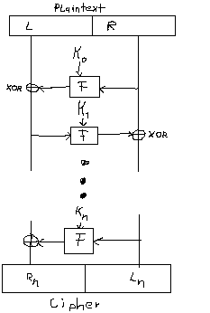

To keep the image simpler, instead of swapping L and R, the direction of F is switched.

AES is based on Substitution–Permutation instead of a Feistel scheme.  
As the name suggests, SP substitute and permute the input bits.  
How this is done is explained in detail in the [AES](#the-aes) section.

In addition to encryption, block ciphers are also used for [Hashing](#hashing), [PRNGs](#randomness) or for creating ciphers.

Because the algorithms are block-based, messages that are longer than one block must be split and merged after processing.  
Different modes can be used for this. In the following section two of them are explained.

### ECB

**Do not use ECB**

Electronic Codebook (ECB) is the simplest block cipher mode. The message is split and each block is computed independently by the block cipher.

**Do not use ECB**

<pre>
C<sub>i</sub> = E<sub>K</sub>(P<sub>i</sub>)
</pre>

**Do not use ECB**

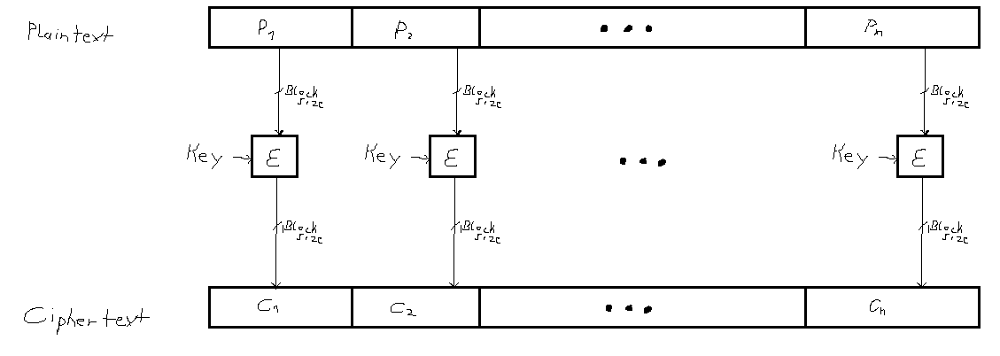

**Do not use ECB**

However this simplicity comes at a cost. The lack of diffusion leads to patterns in the cipher text. A bit change in one block does not propagate to the other blocks. Instead it stays local and only the cipher text for that block changes.


  

*Source: https://en.wikipedia.org/wiki/File:Tux.jpg*  
*Source: https://en.wikipedia.org/wiki/File:Tux_ecb.jpg*

This pictures should speak for themselves. Since the same input leads to the same output, patterns are still visible when applying ECB to an input with repeating patterns (the large areas of same color in the example).

**Do not use ECB**

### CBC
In difference to ECB, in Cipher Block Chaining, each block is XORed with the previous cipher. This chains the blocks together and a change in one block of plaintext affects all following blocks. This increases the diffusion.

Since the first block don't has a previous cipher for the XOR an **Initialization Vector (IV)** is needed. The IV is a random number, which should be **different for every encryption**. In some algorithms the IV is therefore called a **nonce** (number used once). Reusing the nonce reduces the security by leaking information about the first block, or in some modes like OFB and CTR, it destroys the security completely. There are many ways to create suitable IVs. Which one to use depends on the protocol requirements where the cipher is to be used.

Unlike the key, the IV does not need to be private and can be submitted together with the cipher text. Since the recipient needs to know the IV in order to decrypt the message, this is actually necessary.

<pre>
C<sub>0</sub> = IV
C<sub>i</sub> = E<sub>K</sub>(C<sub>i-1</sub> ⊕ P<sub>i</sub>)
</pre>

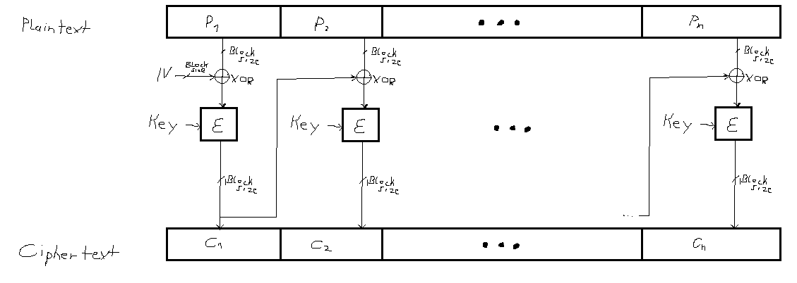

In [Cryptography Engineering](https://www.schneier.com/books/cryptography_engineering/) Schneier et al. suggests to use CBC with random IV over other mode such as CTR, which is explained later.

### Padding
Not all messages are exactly the length of a block (or a multiple of the block size). In order to use a block cipher with these messages, the messages must be padded. The suggested padding standard to do so is **PKCS7**.
<!-- #### More
There are many more operation modes. Some can be found at [Wikipedia](https://en.wikipedia.org/wiki/Block_cipher_mode_of_operation). -->

## Stream Cipher
Stream ciphers don't need to split the message into blocks. Instead they operate directly on the bit or byte level. The key is expanded to be the same size as the message. This expand key is called the keystream. The cipher text is computed by XORing the keystream with the message. To revert the encryption (decryption), the keystream just needs to be XORed with the cipher text. This allows a stream cipher to use the same method for encryption and decryption.

Modern stream ciphers are Salsa20 (used in libsodium [XSalsa20 with a larger nonce]) or ChaCha20 (used for TLS). But there are also operation modes that can be used to turn block ciphers into stream ciphers.
The block cipher is then used to create the keystream. AES-CRT or AES-OFB are stream ciphers that uses this method.

### CTR
The counter mode (CTR) is used to turn a block cipher into a stream cipher. Instead of applying the block cipher to plaintext, it's applied to the key to create the keystream.

Input for the block cipher are the key, and a nonce concatenated with a counter. 
Like in ECB each block is processed independently, they are not chained together. But by adding the counter, the issues from ECB are avoided. 

In CTR the IV is called nonce (number used once). If the same nonce is used twice with the same key, the encryption is broken, such that messages can be decrypted without the key.

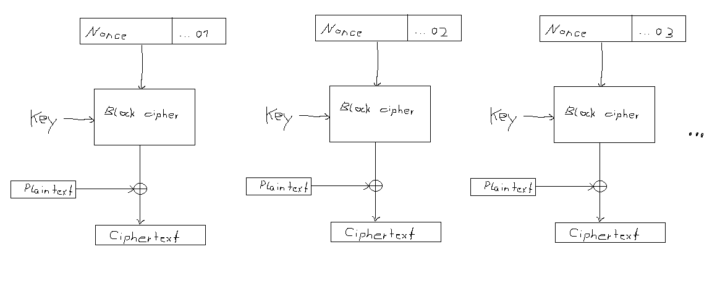

<pre>
C<sub>1</sub> = P<sub>1</sub> ⊕ E<sub>K</sub>(Nonce)
C<sub>2</sub> = P<sub>2</sub> ⊕ E<sub>K</sub>(Nonce)

Then:
C<sub>1</sub> ⊕ C<sub>2</sub> = P<sub>1</sub> ⊕ P<sub>2</sub> 
</pre>

The XOR of the two plaintexts can leak information about the content. This [answer on stackexcange](https://crypto.stackexchange.com/questions/59/taking-advantage-of-one-time-pad-key-reuse/108#108) shows very well that this is an issue.

Also, if the attacker knows P<sub>1</sub>. P<sub>2</sub> can be computed with:

<pre>
P<sub>2</sub> = P<sub>1</sub> ⊕ C<sub>1</sub> ⊕ C<sub>2</sub> 
</pre>

### More Modes
Other modes are Output Feedback (OFB) and Cipher Feedback (CFB). Instead of using the nonce with a counter as input for the block cipher like CTR, they feed either the keystream (output) or the resulting ciphertext (after XORing the keystream with the plaintext) to the next iteration.

More information about this modes can be found [here](www.crypto-it.net/eng/theory/modes-of-block-ciphers.html) or at [Wikipedia](https://en.wikipedia.org/wiki/Block_cipher_mode_of_operation). 

### Salsa20
A commonly used *pure* stream cipher is Salsa20 (or variations thereof such as XSalsa20 or ChaCha20).

Salsa20 also uses a counter (CTR) to create the keystream. The core function operates on a 512 bit state (256 bit key, 64 bit nonce, 64 bit counter and 128 fixed bits) and takes the key, a nonce and the counter as input. *The 128 fixed bits are `expand 32-byte k`  in ASCII ;)*

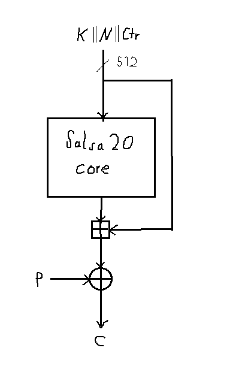

This state gets transformed in 20 rounds with the Quarter-Round-Function (QR) that takes four 32 bit words `a, b, c, d` (unsinged integers) as input and uses XOR `⊕`, additions `+` and bit rotations `<<<` to mix them.

```
def QR(a,b,c,d):
    A = b ⊕ [(a+b) <<<  7]
    B = c ⊕ [(b+a) <<<  9]
    C = b ⊕ [(c+d) <<< 13]
    D = b ⊕ [(d+c) <<< 18]
```

The state can be represented by a 4x4 array of 16 32 bit words. In the array the QR functions is first applied to each column and then to each row. After 10 rounds of mixing rows and columns *(10\*2 = 20. Like in Salsa**20**)* the resulting state is added to the previous input `K||N||CTR` to create the keystream. This last addition is needed to prevent the reversion of the array by applying a reversed QR function.

Like above, XORing the keystream with the plaintext creates the cipher text.

## The AES

AES is block cipher that uses a Substitution-Permutation construct, that operates on a 128 bit state and can be used with 128, 192 and 256 bit keys.

The US bases NIST selected AES the Rijndael algorithm, designed by the Belgians Vincent Rijmen and Joan Daemen, in 2000 as the [winner](https://www.nist.gov/news-events/news/2000/10/commerce-department-announces-winner-global-information-security) of a competition start in 1997 to find a successor for the DES standard.

Today AES is probably the most used crypto algorithm that can be found everywhere. E.g. in Full Disk Encryption, Password safes or Wi-Fi (WPA2).

### Algorithm

Like in every block cipher the message must first be split into blocks. For AES these blocks have a size of 128 bit.

Each block then is computed with the AES core, and is combined to the cipher text with one of the modes explained above.

The core consists of four steps (`AddRoundKey`, `SubBytes`, `ShiftRows`, `MixColumns`), which are repeated in rounds, whereby the number of rounds depends on the key size used.

| Key size | Rounds |
|:--------:|:------:|
| 128 bit  |   10   |
| 192 bit  |   12   |
| 256 bit  |   14   |

The following image shows the sequence of the steps. The first and the last `AddRoundKey` steps are called *Key Whitening*.

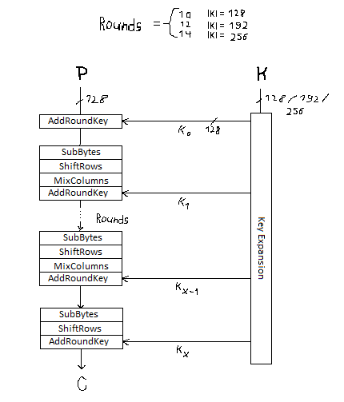

The last step differs from the rounds by leaving out the `MixColumns` step.

### AddRoundKey

In the AddRoundKey step the 128 bit state is XORed with the current round-key.

Without the AddRoundKey, the key would never touch the cipher text, and AES would be usesless byte shufeling.

### SubBytes

SubBytes means byte substitution. The state is divided into 16 words, with one byte each, and replaced by a byte from a *SBox* (Substitution Box). For AES this bob can be seen as a 16×16 table with 256 cells. For example, the hex byte `5A` (0101 1010 in bits) is replaced by the value in the cell of column `5` and row `A` of the table. 

In the following steps it's helpful to see the 16 words as a 4x4 array.

### ShiftRow

In the 4x4 array of words, each row is shifted to the left by a predefined amount of cells. The first row is shifted by zero cells, the second by one, the third by two and the last row by three cells. 

Input array:

|     |     |     |     |
|:---:|:---:|:---:|:---:|
|  0  |  1  |  2  |  3  |
|  4  |  5  |  6  |  7  |
|  8  |  9  |  A  |  B  |
|  C  |  D  |  E  |  F  |

Output array:

|     |     |     |     |
|:---:|:---:|:---:|:---:|
|  0  |  D  |  A  |  7  |
|  4  |  1  |  E  |  B  |
|  8  |  5  |  2  |  F  |
|  C  |  9  |  6  |  3  |

In the image below, this creates the confusing mess of lines.

### MixColumn
In the last step of a round, the columns are mixed by multiplying each column with a fixed 4x4 matrix. The result of this step is, that a change in on byte, also affects the other bytes of the state.

|     |     |     |     |
|:---:|:---:|:---:|:---:|
|  2  |  3  |  1  |  1  |
|  1  |  2  |  3  |  1  |
|  1  |  1  |  2  |  1  |
|  3  |  1  |  1  |  2  |

This multiplication is performed on the Galois Field GF(2<sup>8</sup>) with finite field arithmetic. But to explain how this math works, is out of the scope of this overview. 

### KeyExpansion

To generate the subkeys for each round the *Rijndael Key Schedule* algorithm is used. This algorithm uses the same S-Box for byte substitution (`SubWord`), byte rotation (`RotWord`) and XORs with a constant for each round (`rcon`) to generate 128 bit sub keys. *128 bit are needed to the subkey can be XORed with the state*. 


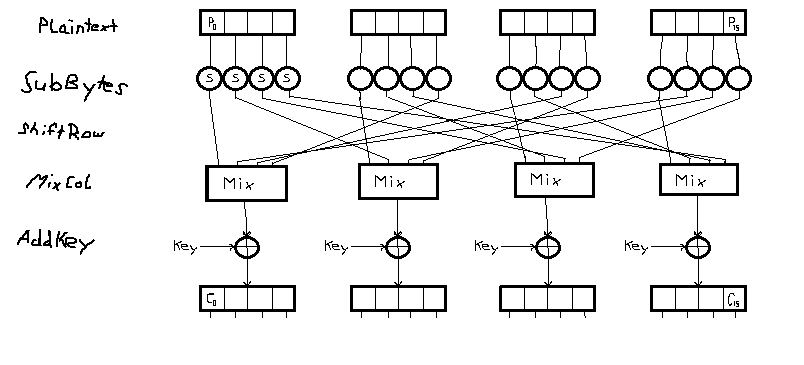

A more detailed description of each step can be found in the official [AES standard](https://nvlpubs.nist.gov/nistpubs/FIPS/NIST.FIPS.197.pdf). 

### AES in NETstandard

Example from [Microsoft docs](https://docs.microsoft.com/en-us/dotnet/api/system.security.cryptography.aes?view=netstandard-2.0)

To keep things short, the validation of the arguments is removed. One should add these back when working with the code.

#### Encrypt

```cs
static byte[] EncryptStringToBytes_Aes(string plainText, byte[] Key, byte[] IV)
{
    // Check arguments.
    // [ ... ]

    byte[] encrypted;
    
    // Create an Aes object
    // with the specified key and IV.
    using (Aes aesAlg = Aes.Create())
    {
        aesAlg.Key = Key;
        aesAlg.IV = IV;

        // Create an encryptor to perform the stream transform.
        ICryptoTransform encryptor = aesAlg.CreateEncryptor(aesAlg.Key, aesAlg.IV);

        // Create the streams used for encryption.
        using (MemoryStream msEncrypt = new MemoryStream())
        using (CryptoStream csEncrypt = new CryptoStream(msEncrypt, encryptor, CryptoStreamMode.Write))
        {
            //Write all data to the stream.
            using (StreamWriter swEncrypt = new StreamWriter(csEncrypt))
                swEncrypt.Write(plainText);

            encrypted = msEncrypt.ToArray();
        }
    }
    // Return the encrypted bytes from the memory stream.
    return encrypted;

    }
```

#### Decrypt

```cs
static string DecryptStringFromBytes_Aes(byte[] cipherText, byte[] Key, byte[] IV)
{
    // Check arguments.
    // [ ... ]

    // Declare the string used to hold
    // the decrypted text.
    string plaintext = null;

    // Create an Aes object
    // with the specified key and IV.
    using (Aes aesAlg = Aes.Create())
    {
        aesAlg.Key = Key;
        aesAlg.IV = IV;

        // Create a decryptor to perform the stream transform.
        ICryptoTransform decryptor = aesAlg.CreateDecryptor(aesAlg.Key, aesAlg.IV);

        // Create the streams used for decryption.
        using (MemoryStream msDecrypt = new MemoryStream(cipherText))
        using (CryptoStream csDecrypt = new CryptoStream(msDecrypt, decryptor, CryptoStreamMode.Read))
        using (StreamReader srDecrypt = new StreamReader(csDecrypt))
        {
            // Read the decrypted bytes from the decrypting stream
            // and place them in a string.
            plaintext = srDecrypt.ReadToEnd();
        }
    }

    return plaintext;
}
```

#### Usage

```cs
public void AesExample()
{
    string original = "Here is some data to encrypt!";

    // Create a new instance of the Aes
    // class.  This generates a new key and initialization 
    // vector (IV).
    using (Aes myAes = Aes.Create())
    {
        // Encrypt the string to an array of bytes.
        byte[] encrypted = EncryptStringToBytes_Aes(original, myAes.Key, myAes.IV);

        // Decrypt the bytes to a string.
        string roundtrip = DecryptStringFromBytes_Aes(encrypted, myAes.Key, myAes.IV);

        //Display the original data and the decrypted data.
        Console.WriteLine("Original:   {0}", original);
        Console.WriteLine("Round Trip: {0}", roundtrip);
    }
}
```

### Authentication

All the modes described above only provides confidentiality against attackers. Even if they can get the plaintext, they can still mess up with the cipher text and flip bits. None of the above described modes detect such tampered messages. Instead the message is decrypted without raising an exception. But of course the resulting plaintexts are not identical.

<!--ToDo: Change Encoding-->
```
plaintext:  eine kuh macht muh, viele kühe machen mühe
// encrypt
ciphertext: 13341374A254D877DAEEC043E1224E3E112B5170B815C66B99DD0C326DF4BDB4F83A32A8BD91DF4F84A1E8607240FEAE
//zero first bytes
tampered:   000000000054D877DAEEC043E1224E3E112B5170B815C66B99DD0C326DF4BDB4F83A32A8BD91DF4F84A1E8607240FEAE
//decrypt
recieved:   ��ڢ\u0001my�\u0010>�Q!�f\\?T�iele kühe machen mühe
```

### MACs

Alternatively a Message Authentication Code (MAC) can be computed and sent together with the cipher text. The receiver can then decrypt the cipher text, compute the MAC himself and compare it with the received one. If both MACs are equal, the cipher text was not tampered. 

<!--One should not reuse the encryption key for the MAC (if the mac is broken and leaks the key, the attacker can decrypt the message). Instead use a random key that get encrypted together with the plaintext. The receiver can than take that key after decryption and compute the MAC. -->

There are three type of AE (Authenticated Encryption) with a MAC. 

<!-- ToDo ?: Images for Macs -->
- **encrypt and MAC**: *calculates the MAC and the cipher text of the plaintext*
- **MAC then encrypt**: *calculates the MAC and encrypts it together with the plaintext* 
- **encrypt then MAC**: *encrypts the plaintext and then calculates the MAC of the cipher text* 

It's suggested to use Encrypt-Then-MAC, since a tampered message gets detected before the message needs to be decrypted.
Algorithms such as HMAC-SHA256 or Poly1305 can be used to generate the MAC. Poly1305 is a hash algorithm with a dedicated design to compute MACs. 

### Authenticated Ciphers

There are cipher operation modes that provides integrity, the NIST standard GCM (Galois/Counter Mode) for example.

GCM can also be used for **AEAD** (Authenticated Encryption with Additional Data). Instead of only validating the plaintext, additional data that are not encrypted can also be validated. With this, the integrity of headers, or other meta information, can be ensured as well.

As of March 2019 AES with GCM is, unfortunately not available in NETstandard. But it can be used in the current dotnet core 3 [preview](https://docs.microsoft.com/en-us/dotnet/api/system.security.cryptography.aesgcm?view=netcore-3.0).

### Usage in Protocols

Just encrypting messages with the same key is often not what you want in a message protocol. One wants to maintain the confidentiality that every message will be received (and they will be received in order) and no messages are added or replayed. One way to do this, is to start with a random nonce that gets incremented with each new message sent. To prevent a message sent from A to B using the same nonce as a message sent from B to A, a tag can be added for the direction, or different keys can be used for each direction.

This construction still has weaknesses. If the key get leaked once, all messages send in the past and future can be decrypted. What one want is something similar to the concept of forward and backward secrecy introduced in the [randomness](#randomness) section. If the key for a message gets leaked, it should not be possible to decrypt any previous send messages as well as  future messages.

To archive this, the key needs to be changed for each message. A protocol that does this is the[Signal Protocol](https://signal.org/docs/specifications/doubleratchet/) used by end-to-end encrypted messengers such as [Signal](https://signal.org) or [WhatsApp](https://www.whatsapp.com/). The Signal Protocol also uses asymmetric key cryptography to exchange new symmetric keys.